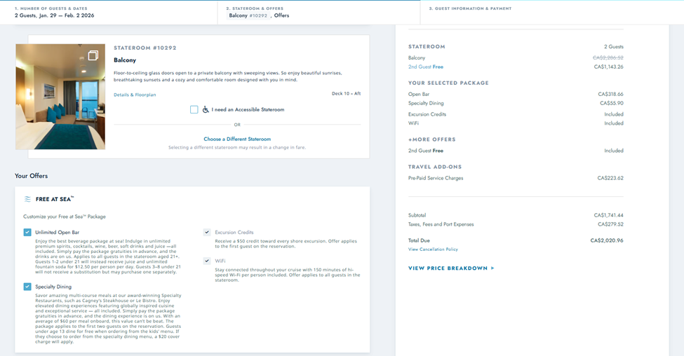
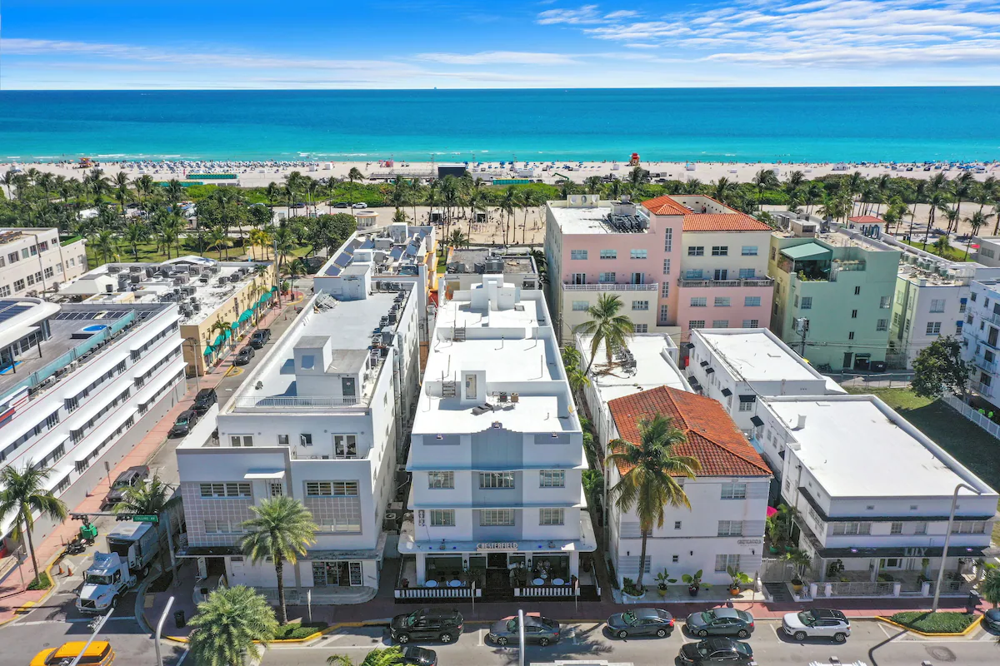

# [Flight Itinerary $594 for 2 people](https://www.google.com/travel/flights/s/bt1EiVMSnQLDBJVK6)

## Departing Flight — Wed, Jan 28

- **YWG → YYC**
  - 6:55 PM — Winnipeg (YWG)
  - 8:16 PM — Calgary (YYC)
  - Layover: 1h 29m

- **YYC → YEG**
  - 9:45 PM — Calgary (YYC)
  - 10:49 PM — Edmonton (YEG)
  - Layover: 1h 56m

- **YEG → ATL**
  - 12:45 AM (+1) — Edmonton (YEG)
  - 7:12 AM (+1) — Atlanta (ATL)
  - Layover: 1h 42m

- **ATL → MIA**
  - 8:54 AM (+1) — Atlanta (ATL)
  - 10:59 AM (+1) — Miami (MIA)
---
## Norwegian Cruise Itinerary $2021

* Thursday Jan 29: Miami, Florida Embark: 4:00 PM
* Friday: Nassau, Bahamas Port time: 8:00 AM – 6:00 PM
* Saturday: At Sea
* Sunday: Great Stirrup Cay, Bahamas (Tender Port) Port time: 8:00 AM – 6:00 PM
*	Monday Feb 2: Miami, Florida Disembark: 7:00 AM

---

## [Miami Beach $382](https://expe.app.link/MOL32gMA7Yb)

* Monday Feb 2, 12:00 AM → Wednesday 4 

## Returning Flight — Wed, Feb 4

- **MIA → ATL**
  - 7:00 AM — Miami (MIA)
  - 9:02 AM — Atlanta (ATL)
  - Layover: 3h 38m

- **ATL → YWG**
  - 12:40 PM — Atlanta (ATL)
  - 3:09 PM — Winnipeg (YWG)

---
# Total $2021 + $597 + $382 = $3000

